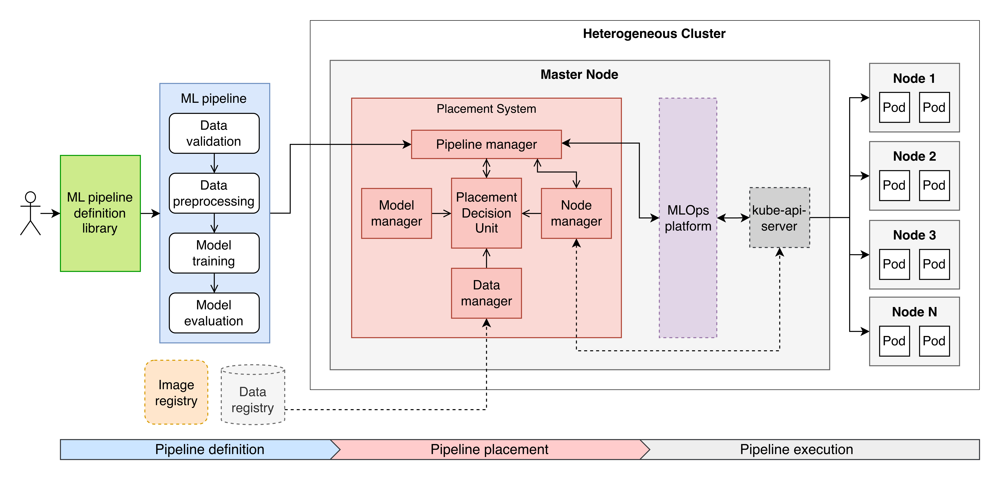

# MLOpX


MLOpX is an end-to-end solution for optimising the execution of Machine Learning (ML) pipelines in heterogeneous computing environments. It allows users to define their own ML pipelines using a **platform-agnostic library** and features a customizable **placement system** that schedules and places each pipeline's tasks on the available nodes in a Kubernetes cluster.

## MLOpX Goals

- **Speed up ML pipeline executions 🚀**: Reduce pipeline execution times by selecting the most appropriate computing resources (nodes in the cluster) for each task, based on their specific requirements, node capabilities, and current cluster load.

- **Efficient Resource Utilization 🌱**: Maximize the utilization of the available nodes and minimize idle times. Currently, Kubernetes does not guarantee an efficient allocation of resources for most MLOps platforms.

- **Flexibility and Extensibility 🛠️**: Allow the addition of custom placement strategies, enabling users to implement their own scheduling algorithms tailored to their specific ML workloads and use cases.

- **Platform Agnosticism 🌐**: Allow easy integration with existing MLOps platforms, enabling users to leverage their current infrastructure while benefiting from improved pipeline execution.

</br>

> [!NOTE]  
> MLOpX is not intended to replace existing MLOps platforms, but rather to enhance them by providing scheduling and placement capabilities that are currently lacking.

## Architecture

As can be seen in the figure below, MLOpX is composed of two main modules that work together to achieve its goals:
- **Pipeline definition library (green box)**: Platform-agnostic library to define ML pipelines.
- **Placement system (red box)**: System that listens for pipeline submissions, schedules them, places their tasks on available nodes in a cluster, and triggers their execution.

The definition library is intended to be used by users to define their own ML pipelines, while the placement system is intended to be deployed alongside an existing MLOps platform to handle the scheduling and placement of the submitted pipelines.



To learn more about how the different components interact with each other whenever a pipeline is submitted, you can see this [sequence diagram](images/sequence_diagram.png).

> [!NOTE]  
> Currently, MLOpX only supports the integration with  [Kubeflow](https://www.kubeflow.org/) as the MLOps platform. However, the architecture is designed to be easily extensible to support other platforms in the future.


## Repository Structure

```
├── client/               # Source code of the pipeline definition library
├── server/               # Source code of the placement system
├── pipelines/            # Examples of pipeline definitions using the library
├── data/                 # Datasets used in the pipeline examples
├── images/               # Auxiliary images for the README file
├── results/              # Scripts and notebooks to analyse performance results
├── utils/                # Utility scripts to upload datasets to a NFS server
└── README.md             # This file
```

## How to run
The placement system, implemented as a FastAPI application and served by an Uvicorn server, exposes a REST API used by the definition library. This API includes a dedicated submission endpoint that handles POST requests containing the pipeline files.

To run the placement system, run the following command from the root directory of the project:

```bash
uvicorn server.main:app  --host 0.0.0.0 --port 8000
```

### Environment Variables
The placement system requires several environment variables to be set for proper configuration. These variables can be defined in a `.env` file in the `server/` directory. The following variables are required:

- `KFP_URL`: The URL of the Kubeflow Pipelines (KFP) API.
- `PROMETHEUS_URL`: The URL of the Prometheus server for monitoring the cluster nodes.
- `PIPELINES_DIR`: The directory where the pipeline related files are stored (server-side).
- `WAIT_INTERVAL`: The interval (in seconds) to wait for new pipeline submissions (defaults to 15).
- `UPDATE_INTERVAL`: The interval (in seconds) to query the KFP API for pipeline status updates (defaults to 5).

### Placement Strategies
The placement system supports the integration of custom placement strategies. These strategies are implemented as Python classes that inherit from the [`PlacerInterface`](server/placers/interface.py) abstract class. The placement strategy is responsible for scheduling the pipelines and mapping their tasks to the available nodes in the cluster.

To uniquely identify each placement strategy, the strategies must be registered in the Placement Decision Unit class, which is defined in the [`decision_unit.py`](server/components/decision_unit.py) module. The registration is done by adding a name and the corresponding class to the `placers` dictionary.

When running the placement system, the desired placement strategy can be selected by setting the `PLACER` environment variable. Currently, the following placement strategies are available:

```bash
PLACER="random_random"
PLACER="fifo_random"
PLACER="fifo_round_robin"
PLACER="custom"
```

### Pipeline Execution
The placement system interacts with an instance of Kubeflow Pipelines (KFP) to execute the submitted pipelines. 

Once the system schedules and places the pipelines, it compiles the pipeline definition into a KFP pipeline and submits it for execution. This compilation process specifies the cluster nodes on which the tasks will run, based on the placement decisions made by the selected strategy.

The system manages the execution of the pipelines by monitoring their status through the KFP API. It retrieves the execution status of each pipeline and updates their status accordingly. The system also handles the waiting and running states of the pipelines, ensuring that they are executed in a timely manner.

## Defining and Submitting Pipelines

To understand how to define pipelines using the provided library, you can refer to the documentation provided in the [`client/`](client/) directory. Multiple examples of pipeline definitions using the library can be found in the [`pipelines/`](pipelines/) directory.

To submit a pipeline to the placement system, simply execute the pipeline definition file as a standard Python script. The library will automatically handle the submission process to the placement system.

## Authors
- **Pedro Rodrigues** - [pedro535](https://github.com/pedro535)

## License
This project is licensed under the MIT License - see the [LICENSE](LICENSE) file for details.
